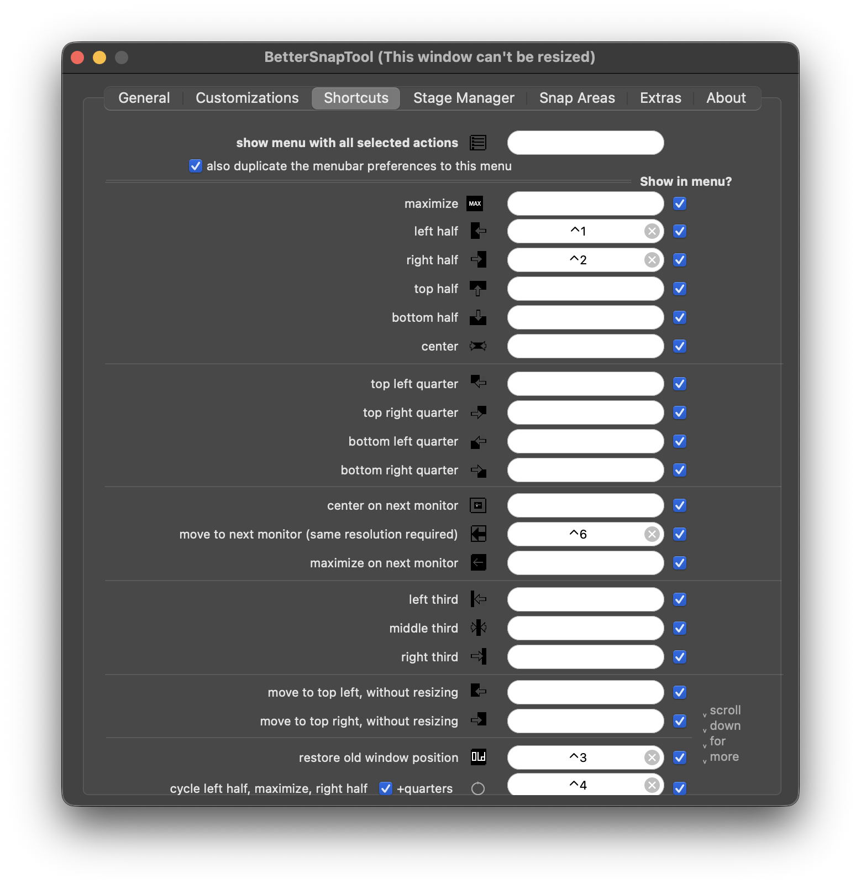

dotfiles
---

## local
```
$ brew install z gh ghq peco fzf tmux trash nkf orbstack mise
$ ./dotfilesLink.sh
```

emacs
```
$ brew install --cask emacs-app emacs-plus alt-tab
$ git clone https://github.com/syl20bnr/spacemacs ~/.emacs.d
```

## GUI
### Mac
`Ctrl + Space` にMacがキーバインドを設定しているため無効化。  
[System] -> [入力ソース] -> [前の入力ソースを選択]

### Terminal
`Alt + h` で単語削除をさせる
[設定] -> [プロファイル] -> [キーボード] -> [メタキーとしてOptionキーを使用]

### Chrome
`Ctrl + g` にChromeのGeminiがキーバインドを設定しているため無効化。  
[Chrome] -> [設定] -> [AIイノベーション] -> [Gemini in Chrome]

### VSCode系エディタ
pluginは `Awesome Emacs Keymap` を使用。  
Keybindingは最低限以下を追加。
```json
[
    {
        "key": "alt+h",
        "command": "deleteWordLeft",
        "when": "editorTextFocus && !editorReadonly"
    }
]
```

### AltTab


## server
`.bashrc` と `.emacs.d/init.el.server` を読み込ませる
```
# curl https://y-ohgi.github.io/dotfiles/install.sh | sh
```
